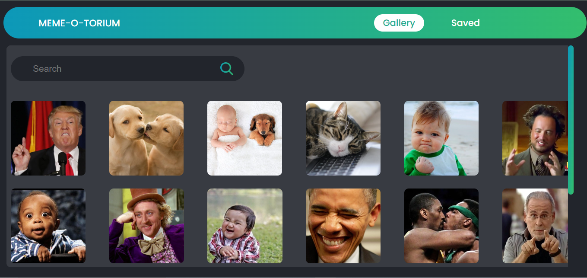
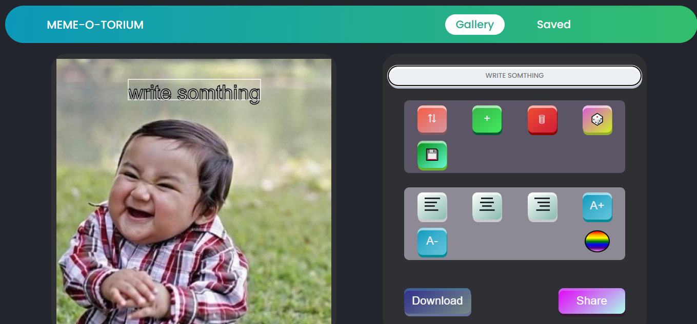

# Meme Generator

A simple meme generator project utilizing HTML5 Canvas and responsive design for mobile devices.

## Table of Contents

- [Introduction](#introduction)
- [Features](#features)
- [Installation](#installation)
- [Usage](#usage)
- [Demo](#demo)
- [Acknowledgments](#acknowledgments)
- [Author](#author)

## Introduction

Welcome to the Meme Generator! This project allows users to create custom memes using HTML5 Canvas. It is designed to be responsive, providing an optimal experience for users on mobile devices. Express your creativity by adding text and images to generate humorous memes easily.

## Features

- Responsive design for mobile users.
- HTML5 Canvas for meme creation.
- Integration with external services for additional features.

## Installation

1. Clone the repository: `git clone https://github.com/toap012/Project-MemeGenerator.git`
2. Open the `index.html` file in your web browser.

## Usage

1. Open the Meme Generator in your web browser.
2. Choose an image or upload your own.
3. Add text and customize the meme.
4. Save or share your hilarious creation!

## Demo

## License

This Meme Generator is licensed under the [MIT License](LICENSE).

## Author

- Name: Tomer Appelman
- GitHub: [toap012](https://github.com/toap012)
- Email: toap012@gmail.com
